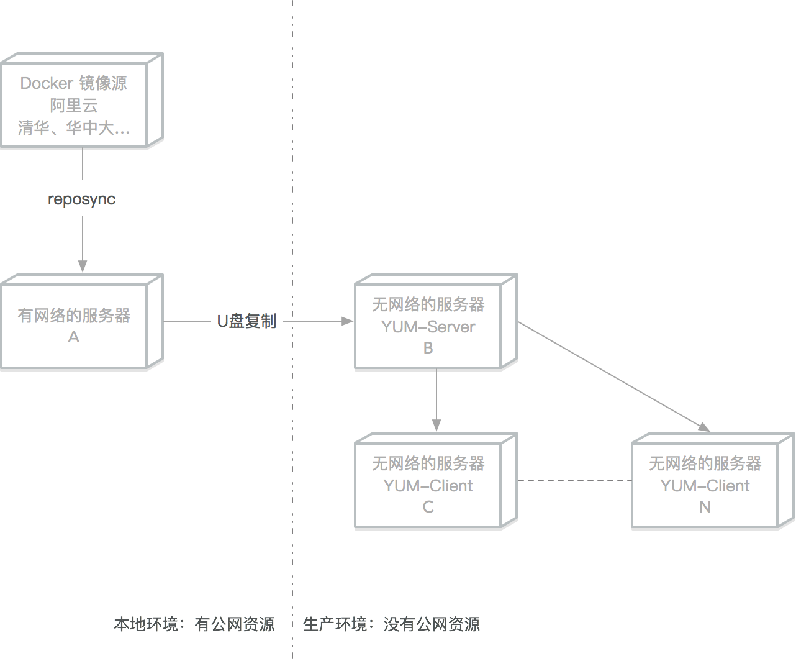
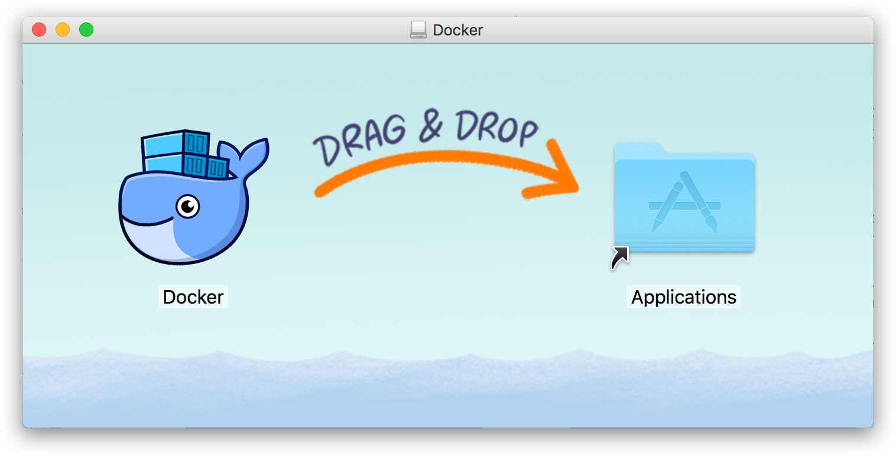
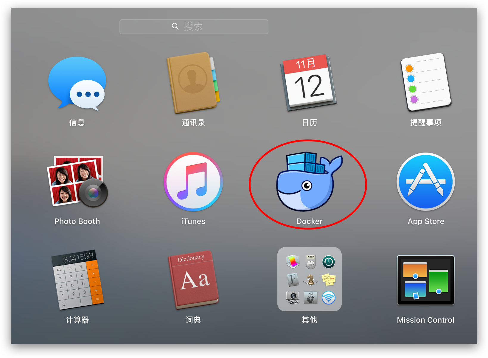
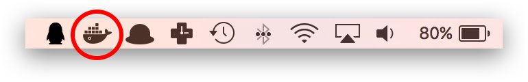
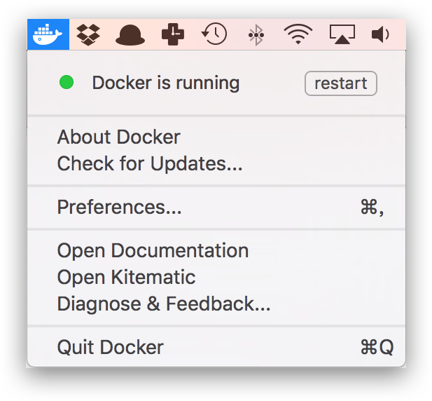
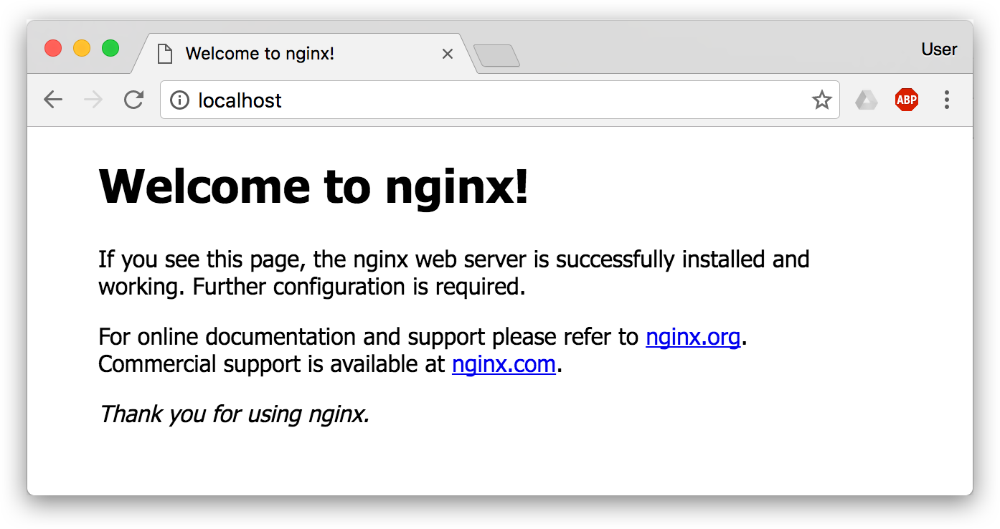

# 安装 Docker


Docker 分为 `stable` `test` 和 `nightly` 三个更新频道。

官方网站上有各种环境下的 [安装指南](https://docs.docker.com/get-docker/)，这里主要介绍 Docker 在 `Linux` 、`Windows 10` 和 `macOS` 上的安装。

# Ubuntu


> 警告：切勿在没有配置 Docker APT 源的情况下直接使用 apt 命令安装 Docker.

## 准备工作

### 系统要求

Docker 支持以下版本的 [Ubuntu](https://ubuntu.com/server) 操作系统：

- `Ubuntu Hirsute 21.04`
- `Ubuntu Groovy 20.10`
- `Ubuntu Focal 20.04 (LTS)`
- `Ubuntu Bionic 18.04 (LTS)`

Docker 可以安装在 64 位的 x86 平台或 ARM 平台上。Ubuntu 发行版中，LTS（Long-Term-Support）长期支持版本，会获得 5 年的升级维护支持，这样的版本会更稳定，因此在生产环境中推荐使用 LTS 版本。

### 卸载旧版本

旧版本的 Docker 称为 `docker` 或者 `docker-engine`，使用以下命令卸载旧版本：

```bash
$ sudo apt-get remove docker \

               docker-engine \

               docker.io
```

## 使用 APT 安装

由于 `apt` 源使用 HTTPS 以确保软件下载过程中不被篡改。因此，我们首先需要添加使用 HTTPS 传输的软件包以及 CA 证书。

```bash
$ sudo apt-get update
```

```bash
$ sudo apt-get install \
    apt-transport-https \
    ca-certificates \
    curl \
    gnupg \
    lsb-release
```

鉴于国内网络问题，强烈建议使用国内源，官方源请在注释中查看。

为了确认所下载软件包的合法性，需要添加软件源的 `GPG` 密钥。

```bash
$ curl -fsSL https://mirrors.aliyun.com/docker-ce/linux/ubuntu/gpg | sudo gpg --dearmor -o /usr/share/keyrings/docker-archive-keyring.gpg

# 官方源
# $ curl -fsSL https://download.docker.com/linux/ubuntu/gpg | sudo gpg --dearmor -o /usr/share/keyrings/docker-archive-keyring.gpg
```

然后，我们需要向 `sources.list` 中添加 Docker 软件源

```bash
$ echo \
  "deb [arch=amd64 signed-by=/usr/share/keyrings/docker-archive-keyring.gpg] https://mirrors.aliyun.com/docker-ce/linux/ubuntu \
  $(lsb_release -cs) stable" | sudo tee /etc/apt/sources.list.d/docker.list > /dev/null

# 官方源
# $ echo \
#   "deb [arch=amd64 signed-by=/usr/share/keyrings/docker-archive-keyring.gpg] https://download.docker.com/linux/ubuntu \
#   $(lsb_release -cs) stable" | sudo tee /etc/apt/sources.list.d/docker.list > /dev/null
```

> 以上命令会添加稳定版本的 Docker APT 镜像源，如果需要测试版本的 Docker 请将 stable 改为 test。

### 安装 Docker

更新 apt 软件包缓存，并安装 `docker-ce`：

```bash
$ sudo apt-get update

$ sudo apt-get install docker-ce docker-ce-cli containerd.io
```

## 使用脚本自动安装

在测试或开发环境中 Docker 官方为了简化安装流程，提供了一套便捷的安装脚本，Ubuntu 系统上可以使用这套脚本安装，另外可以通过 `--mirror` 选项使用国内源进行安装：

> 若你想安装测试版的 Docker, 请从 test.docker.com 获取脚本

```bash
# $ curl -fsSL test.docker.com -o get-docker.sh
$ curl -fsSL get.docker.com -o get-docker.sh
$ sudo sh get-docker.sh --mirror Aliyun
# $ sudo sh get-docker.sh --mirror AzureChinaCloud
```

执行这个命令后，脚本就会自动的将一切准备工作做好，并且把 Docker 的稳定(stable)版本安装在系统中。

## 启动 Docker

```bash
$ sudo systemctl enable docker

$ sudo systemctl start docker
```

## 建立 docker 用户组

默认情况下，`docker` 命令会使用 [Unix socket](https://en.wikipedia.org/wiki/Unix_domain_socket) 与 Docker 引擎通讯。而只有 `root` 用户和 `docker` 组的用户才可以访问 Docker 引擎的 Unix socket。出于安全考虑，一般 Linux 系统上不会直接使用 `root` 用户。因此，更好地做法是将需要使用 `docker` 的用户加入 `docker` 用户组。

建立 `docker` 组：

```bash
$ sudo groupadd docker
```

将当前用户加入 `docker` 组：

```bash
$ sudo usermod -aG docker $USER
```

退出当前终端并重新登录，进行如下测试。

## 测试 Docker 是否安装正确

```bash
$ docker run --rm hello-world

Unable to find image 'hello-world:latest' locally
latest: Pulling from library/hello-world
b8dfde127a29: Pull complete
Digest: sha256:308866a43596e83578c7dfa15e27a73011bdd402185a84c5cd7f32a88b501a24
Status: Downloaded newer image for hello-world:latest
Hello from Docker!
This message shows that your installation appears to be working correctly.
To generate this message, Docker took the following steps:
1. The Docker client contacted the Docker daemon.
2. The Docker daemon pulled the "hello-world" image from the Docker Hub.
	(amd64)
3. The Docker daemon created a new container from that image which runs the
    executable that produces the output you are currently reading.
4. The Docker daemon streamed that output to the Docker client, which sent it
   to your terminal.

To try something more ambitious, you can run an Ubuntu container with:
 $ docker run -it ubuntu bash

Share images, automate workflows, and more with a free Docker ID:
 https://hub.docker.com/

For more examples and ideas, visit:
 https://docs.docker.com/get-started/
```

若能正常输出以上信息，则说明安装成功。

## 镜像加速

如果在使用过程中发现拉取 Docker 镜像十分缓慢，可以配置 Docker **国内镜像加速**。

# CentOS

> 警告：切勿在没有配置 Docker YUM 源的情况下直接使用 yum 命令安装 Docker.

## 准备工作

### 系统要求

Docker 支持 64 位版本 CentOS 7/8，并且要求内核版本不低于 3.10。 CentOS 7 满足最低内核的要求，但由于内核版本比较低，部分功能（如 `overlay2` 存储层驱动）无法使用，并且部分功能可能不太稳定。

### 卸载旧版本

旧版本的 Docker 称为 `docker` 或者 `docker-engine`，使用以下命令卸载旧版本：

```bash
$ sudo yum remove docker \
                 docker-client \
                 docker-client-latest \
                 docker-common \
                 docker-latest \
                 docker-latest-logrotate \
                 docker-logrotate \
                 docker-selinux \
                 docker-engine-selinux \
                 docker-engine
```

## 使用 yum 安装

执行以下命令安装依赖包：

```bash
$ sudo yum install -y yum-utils
```

鉴于国内网络问题，强烈建议使用国内源，官方源请在注释中查看。

执行下面的命令添加 `yum` 软件源：

```bash
$ sudo yum-config-manager \
   --add-repo \
   https://mirrors.aliyun.com/docker-ce/linux/centos/docker-ce.repo

$ sudo sed -i 's/download.docker.com/mirrors.aliyun.com\/docker-ce/g' /etc/yum.repos.d/docker-ce.repo

# 官方源
# $ sudo yum-config-manager \
#     --add-repo \
#     https://download.docker.com/linux/centos/docker-ce.repo
```

如果需要测试版本的 Docker 请执行以下命令：

```bash
$ sudo yum-config-manager --enable docker-ce-test
```

### 安装 Docker

更新 `yum` 软件源缓存，并安装 `docker-ce`。

```bash
$ sudo yum install docker-ce docker-ce-cli containerd.io
```

## CentOS8 额外设置

由于 CentOS8 防火墙使用了 `nftables`，但 Docker 尚未支持 `nftables`， 我们可以使用如下设置使用 `iptables`：

更改 `/etc/firewalld/firewalld.conf`

```bash
# FirewallBackend=nftables
FirewallBackend=iptables
```

或者执行如下命令：

```bash
$ firewall-cmd --permanent --zone=trusted --add-interface=docker0
$ firewall-cmd --reload
```

## 使用脚本自动安装

在测试或开发环境中 Docker 官方为了简化安装流程，提供了一套便捷的安装脚本，CentOS 系统上可以使用这套脚本安装，另外可以通过 `--mirror` 选项使用国内源进行安装：

> 若你想安装测试版的 Docker, 请从 test.docker.com 获取脚本

```bash
# $ curl -fsSL test.docker.com -o get-docker.sh
$ curl -fsSL get.docker.com -o get-docker.sh
$ sudo sh get-docker.sh --mirror Aliyun
# $ sudo sh get-docker.sh --mirror AzureChinaCloud
```

执行这个命令后，脚本就会自动的将一切准备工作做好，并且把 Docker 的稳定(stable)版本安装在系统中。

## 启动 Docker

```bash
$ sudo systemctl enable docker
$ sudo systemctl start docker
```

## 建立 docker 用户组

默认情况下，`docker` 命令会使用 [Unix socket](https://en.wikipedia.org/wiki/Unix_domain_socket) 与 Docker 引擎通讯。而只有 `root` 用户和 `docker` 组的用户才可以访问 Docker 引擎的 Unix socket。出于安全考虑，一般 Linux 系统上不会直接使用 `root` 用户。因此，更好地做法是将需要使用 `docker` 的用户加入 `docker` 用户组。

建立 `docker` 组：

```bash
$ sudo groupadd docker
```

将当前用户加入 `docker` 组：

```bash
$ sudo usermod -aG docker $USER
```

退出当前终端并重新登录，进行如下测试。

## 测试 Docker 是否安装正确

```bash
$ docker run --rm hello-world
Unable to find image 'hello-world:latest' locally
latest: Pulling from library/hello-world
b8dfde127a29: Pull complete
Digest: sha256:308866a43596e83578c7dfa15e27a73011bdd402185a84c5cd7f32a88b501a24
Status: Downloaded newer image for hello-world:latest

Hello from Docker!

This message shows that your installation appears to be working correctly.
To generate this message, Docker took the following steps:

1. The Docker client contacted the Docker daemon.
2. The Docker daemon pulled the "hello-world" image from the Docker Hub.
   (amd64)
3. The Docker daemon created a new container from that image which runs the
   executable that produces the output you are currently reading.
4. The Docker daemon streamed that output to the Docker client, which sent it
   to your terminal.

To try something more ambitious, you can run an Ubuntu container with:
 $ docker run -it ubuntu bash

Share images, automate workflows, and more with a free Docker ID:

 https://hub.docker.com/

For more examples and ideas, visit:
 https://docs.docker.com/get-started/
```

若能正常输出以上信息，则说明安装成功。

## 镜像加速

如果在使用过程中发现拉取 Docker 镜像十分缓慢，可以配置 Docker **国内镜像加速**。

## 添加内核参数

如果在 CentOS 使用 Docker 看到下面的这些警告信息：

```bash
WARNING: bridge-nf-call-iptables is disabled
WARNING: bridge-nf-call-ip6tables is disabled
```

请添加内核配置参数以启用这些功能。

```bash
$ sudo tee -a /etc/sysctl.conf <<-EOF
net.bridge.bridge-nf-call-ip6tables = 1
net.bridge.bridge-nf-call-iptables = 1
EOF
```

然后重新加载 `sysctl.conf` 即可

```bash
$ sudo sysctl -p
```

# Linux 离线安装

生产环境中一般都是没有公网资源的，本文介绍如何在生产服务器上离线部署`Docker`

括号内的字母表示该操作需要在哪些服务器上执行



## Centos7 离线安装Docker

### YUM本地文件安装（推荐）

推荐这种方式，是因为在生产环境种一般会选定某个指定的文档软件版本使用。

#### 查询可用的软件版本(A)

```bash
#下载清华的镜像源文件
wget -O /etc/yum.repos.d/docker-ce.repo https://download.docker.com/linux/centos/docker-ce.repo

sudo sed -i 's+download.docker.com+mirrors.tuna.tsinghua.edu.cn/docker-ce+' /etc/yum.repos.d/docker-ce.repo

yum update
```

```bash
sudo yum list docker-ce --showduplicates|sort -r

Loading mirror speeds from cached hostfile
Loaded plugins: fastestmirror
docker-ce.x86_64            3:19.03.8-3.el7                     docker-ce-stable
docker-ce.x86_64            3:19.03.7-3.el7                     docker-ce-stable
docker-ce.x86_64            3:19.03.6-3.el7                     docker-ce-stable
docker-ce.x86_64            3:19.03.5-3.el7                     docker-ce-stable
docker-ce.x86_64            3:19.03.4-3.el7                     docker-ce-stable
docker-ce.x86_64            3:19.03.3-3.el7                     docker-ce-stable
docker-ce.x86_64            3:19.03.2-3.el7                     docker-ce-stable
docker-ce.x86_64            3:19.03.1-3.el7                     docker-ce-stable
....
```

#### 下载到指定文件夹(A)

```bash
sudo yum install --downloadonly --downloaddir=/tmp/docker-19.03 docker-ce-19.03.8-3.el7 docker-ce-cli-19.03.8-3.el7 
```

```bash
Dependencies Resolved

====================================================================================================================================================================================
 Package                                          Arch                                  Version                                         Repository                             Size
====================================================================================================================================================================================
Installing:
 docker-ce                                        x86_64                                3:19.03.8-3.el7                                 docker                                 25 M
Installing for dependencies:
 container-selinux                                noarch                                2:2.107-3.el7                                   extras                                 39 k
 containerd.io                                    x86_64                                1.2.13-3.1.el7                                  docker                                 23 M
 docker-ce-cli                                    x86_64                                1:19.03.8-3.el7                                 docker                                 40 M

Transaction Summary

====================================================================================================================================================================================

Install  1 Package (+3 Dependent packages)

Total download size: 87 M

Installed size: 363 M

Background downloading packages, then exiting:

(1/4): container-selinux-2.107-3.el7.noarch.rpm                                                                                                              |  39 kB  00:00:00

(2/4): containerd.io-1.2.13-3.1.el7.x86_64.rpm                                                                                                               |  23 MB  00:00:00

(3/4): docker-ce-19.03.8-3.el7.x86_64.rpm                                                                                                                    |  25 MB  00:00:00

(4/4): docker-ce-cli-19.03.8-3.el7.x86_64.rpm                                                                                                                |  40 MB  00:00:00
------------------------------------------------------------------------------------------------------------------------------------------------------------------------------------
Total                                                                                                                                               118 MB/s |  87 MB  00:00:00
exiting because "Download Only" specified
```

#### 复制到目标服务器之后进入文件夹安装(C-N)

```bash
yum install *.rpm
```

#### 锁定软件版本(C-N)

**下载锁定版本软件**

可参考下文的网络源搭建

```bash
sudo yum install yum-plugin-versionlock
```

**锁定软件版本**

```bash
sudo yum versionlock add docker
```

**查看锁定列表**

```bash
sudo yum versionlock list
```

```bash
Loaded plugins: fastestmirror, versionlock
3:docker-ce-18.09.9-3.el7.*
versionlock list done
```

**锁定后无法再更新**

```bash
sudo yum install docker-ce
```

```bash
Loaded plugins: fastestmirror, versionlock
Loading mirror speeds from cached hostfile
Excluding 1 update due to versionlock (use "yum versionlock status" to show it)
Package 3:docker-ce-18.09.9-3.el7.x86_64 already installed and latest version
Nothing to do
```

**解锁指定软件**

```bash
sudo yum versionlock delete docker-ce
```

```bash
Loaded plugins: fastestmirror, versionlock
Deleting versionlock for: 3:docker-ce-18.09.9-3.el7.*
versionlock deleted: 1
```

**解锁所有软件**

```bash
sudo yum versionlock delete all
```

### YUM 本地源服务器搭建安装Docker

#### 挂载 ISO 镜像搭建本地 File 源（AB）

```bash
# 删除其他网络源
rm -f /etc/yum.repo.d/*
# 挂载光盘或者iso镜像
mount /dev/cdrom /mnt
```

```bash
# 添加本地源
cat >/etc/yum.repos.d/local_files.repo<< EOF
[Local_Files]
name=Local_Files
baseurl=file:///mnt
enable=1
gpgcheck=0
gpgkey=file:///mnt/RPM-GPG-KEY-CentOS-7
EOF
```

```bash
# 测试刚才的本地源,安装createrepo软件
yum clean all 
yum install createrepo -y
```

#### 根据本地文件搭建BASE网络源（B）

```bash
# 安装apache 服务器
yum install httpd -y
# 挂载光盘
mount /dev/cdrom /mnt
# 新建centos目录
mkdir /var/www/html/base
# 复制光盘内的文件到刚才新建的目录
cp -R /mnt/Packages/* /var/www/html/base/
createrepo  /var/www/html/centos/
systemctl enable httpd
systemctl start httpd
```

#### 下载Docker-CE 镜像仓库（A）

在有网络的服务器上下载Docker-ce镜像

```bash
# 下载清华的镜像源文件
wget -O /etc/yum.repos.d/docker-ce.repo https://download.docker.com/linux/centos/docker-ce.repo
sudo sed -i 's+download.docker.com+mirrors.tuna.tsinghua.edu.cn/docker-ce+' /etc/yum.repos.d/docker-ce.repo
```

```bash
# 新建 docker-ce目录
mkdir /tmp/docker-ce/
# 把镜像源同步到镜像文件中
reposync -r docker-ce-stable -p /tmp/docker-ce/
```

#### 创建仓库索引（B）

把下载的 docker-ce 文件夹复制到离线的服务器

```bash
# 把docker-ce 文件夹复制到/var/www/html/docker-ce
# 重建索引
createrepo  /var/www/html/docker-ce/
```

#### YUM 客户端设置（C...N）

```bash
rm -f /etc/yum.repo.d/*
cat >/etc/yum.repos.d/local_files.repo<< EOF
[local_base]
name=local_base
# 改成B服务器地址
baseurl=http://x.x.x.x/base
enable=1
gpgcheck=0
proxy=_none_
[docker_ce]
name=docker_ce
# 改成B服务器地址
baseurl=http://x.x.x.x/base
enable=1
gpgcheck=0
proxy=_none_
EOF
```

#### Docker 安装（C...N）

```bash
sudo yum makecache fast
sudo yum install docker-ce docker-ce-cli containerd.io
sudo systemctl enable docker
```

# macOS

## 系统要求

[Docker Desktop for Mac](https://docs.docker.com/docker-for-mac/) 要求系统最低为 macOS 必须是 10.15 或更高版本， Catalina、Big Sur 或者 Monterey，建议升级到最新版本的 macOS。

## 安装

### 使用 Homebrew 安装

[Homebrew](https://brew.sh/) 的 [Cask](https://github.com/Homebrew/homebrew-cask) 已经支持 Docker Desktop for Mac，因此可以很方便的使用 Homebrew Cask 来进行安装：

```bash
$ brew install --cask docker
```

### 手动下载安装

如果需要手动下载，请点击以下 [链接](https://desktop.docker.com/mac/main/amd64/Docker.dmg) 下载 Docker Desktop for Mac。

> 如果你的电脑搭载的是 M1 芯片（`arm64` 架构），请点击以下 [链接](https://desktop.docker.com/mac/main/arm64/Docker.dmg) 下载 Docker Desktop for Mac。你可以在 [官方文档](https://docs.docker.com/docker-for-mac/apple-silicon/) 查阅已知的问题。

如同 macOS 其它软件一样，安装也非常简单，双击下载的 `.dmg` 文件，然后将那只叫 [Moby](https://www.docker.com/blog/call-me-moby-dock/) 的鲸鱼图标拖拽到 `Application` 文件夹即可（其间需要输入用户密码）。



## 运行

从应用中找到 Docker 图标并点击运行。



运行之后，会在右上角菜单栏看到多了一个鲸鱼图标，这个图标表明了 Docker 的运行状态。



每次点击鲸鱼图标会弹出操作菜单。



之后，你可以在终端通过命令检查安装后的 Docker 版本。

```bash
$ docker --version

Docker version 20.10.0, build 7287ab3
```

如果 `docker version`、`docker info` 都正常的话，可以尝试运行一个 [Nginx 服务器](https://hub.docker.com/_/nginx/)：

```bash
$ docker run -d -p 80:80 --name webserver nginxv
```

服务运行后，可以访问 [http://localhost](http://localhost/)，如果看到了 "Welcome to nginx!"，就说明 Docker Desktop for Mac 安装成功了。



要停止 Nginx 服务器并删除执行下面的命令：

```bash
$ docker stop webserver
$ docker rm webserver
```

## 镜像加速

如果在使用过程中发现拉取 Docker 镜像十分缓慢，可以配置 Docker **国内镜像加速**。

# Windows 10


## 系统要求

[Docker Desktop for Windows](https://docs.docker.com/docker-for-windows/install/) 支持 64 位版本的 Windows 10 Pro，且必须开启 Hyper-V（若版本为 v1903 及以上则无需开启 Hyper-V），或者 64 位版本的 Windows 10 Home v1903 及以上版本。

## 安装

**手动下载安装**

点击以下 [链接](https://desktop.docker.com/win/main/amd64/Docker Desktop Installer.exe) 下载 Docker Desktop for Windows。

下载好之后双击 `Docker Desktop Installer.exe` 开始安装。

**使用** [**winget**](https://docs.microsoft.com/zh-cn/windows/package-manager/) **安装**

```bash
$ winget install Docker.DockerDesktop
```

## 在 WSL2 运行 Docker

若你的 Windows 版本为 Windows 10 专业版或家庭版 v1903 及以上版本可以使用 WSL2 运行 Docker，具体请查看 [Docker Desktop WSL 2 backend](https://docs.docker.com/docker-for-windows/wsl/)。

## 运行

在 Windows 搜索栏输入 **Docker** 点击 **Docker Desktop** 开始运行。


Docker 启动之后会在 Windows 任务栏出现鲸鱼图标。


等待片刻，当鲸鱼图标静止时，说明 Docker 启动成功，之后你可以打开 PowerShell 使用 Docker。

> 推荐使用 [Windows Terminal](https://docs.microsoft.com/zh-cn/windows/terminal/get-started) 在终端使用 Docker。

## 镜像加速

如果在使用过程中发现拉取 Docker 镜像十分缓慢，可以配置 Docker **国内镜像加速**

# 镜像加速器


国内从 Docker Hub 拉取镜像有时会遇到困难，此时可以配置镜像加速器。国内很多云服务商都提供了国内加速器服务，例如：

- [阿里云加速器(点击管理控制台 -> 登录账号(淘宝账号) -> 右侧镜像工具 -> 镜像加速器 -> 复制加速器地址)](https://www.aliyun.com/product/acr?source=5176.11533457&userCode=8lx5zmtu)
- [网易云加速器 `https://hub-mirror.c.163.com`](https://www.163yun.com/help/documents/56918246390157312)
- [百度云加速器 `https://mirror.baidubce.com`](https://cloud.baidu.com/doc/CCE/s/Yjxppt74z#使用dockerhub加速器)

**由于镜像服务可能出现宕机，建议同时配置多个镜像。各个镜像站测试结果请到** [**docker-practice/docker-registry-cn-mirror-test**](https://github.com/docker-practice/docker-registry-cn-mirror-test/actions) **查看。**

> 国内各大云服务商（腾讯云、阿里云、百度云）均提供了 Docker 镜像加速服务，建议根据运行 Docker 的云平台选择对应的镜像加速服务，具体请参考本页最后一小节。

本节我们以 [网易云](https://www.163yun.com/) 镜像服务 `https://hub-mirror.c.163.com` 为例进行介绍。

## Ubuntu 16.04+、Debian 8+、CentOS 7+

目前主流 Linux 发行版均已使用 [systemd](https://systemd.io/) 进行服务管理，这里介绍如何在使用 systemd 的 Linux 发行版中配置镜像加速器。

请首先执行以下命令，查看是否在 `docker.service` 文件中配置过镜像地址。

```bash
$ systemctl cat docker | grep '\-\-registry\-mirror'
```

如果该命令有输出，那么请执行 `$ systemctl cat docker` 查看 `ExecStart=` 出现的位置，修改对应的文件内容去掉 `--registry-mirror` 参数及其值，并按接下来的步骤进行配置。

如果以上命令没有任何输出，那么就可以在 `/etc/docker/daemon.json` 中写入如下内容（如果文件不存在请新建该文件）：

```json
{
  "registry-mirrors": [
    "https://hub-mirror.c.163.com",
    "https://mirror.baidubce.com"
  ]
}
```

> 注意，一定要保证该文件符合 json 规范，否则 Docker 将不能启动。

之后重新启动服务。

```bash
$ sudo systemctl daemon-reload
$ sudo systemctl restart docker
```

## Windows 10

对于使用 `Windows 10` 的用户，在任务栏托盘 Docker 图标内右键菜单选择 `Settings`，打开配置窗口后在左侧导航菜单选择 `Docker Engine`，在右侧像下边一样编辑 json 文件，之后点击 `Apply & Restart` 保存后 Docker 就会重启并应用配置的镜像地址了。

```json
{
  "registry-mirrors": [
    "https://hub-mirror.c.163.com",
    "https://mirror.baidubce.com"
  ]
}
```

## macOS

对于使用 macOS 的用户，在任务栏点击 Docker Desktop 应用图标 -> `Settings...`，在左侧导航菜单选择 `Docker Engine`，在右侧像下边一样编辑 json 文件。修改完成之后，点击 `Apply & restart` 按钮，Docker 就会重启并应用配置的镜像地址了。

```json
{
  "registry-mirrors": [
    "https://hub-mirror.c.163.com",
    "https://mirror.baidubce.com"
  ]
}
```

## 检查加速器是否生效

执行 `$ docker info`，如果从结果中看到了如下内容，说明配置成功。

```bash
Registry Mirrors:
 https://hub-mirror.c.163.com/
```

## `k8s.gcr.io` 镜像

可以登录 [阿里云 容器镜像服务](https://www.aliyun.com/product/acr?source=5176.11533457&userCode=8lx5zmtu&type=copy) **镜像中心** -> **镜像搜索** 查找。

例如 `k8s.gcr.io/coredns:1.6.7` 镜像可以用 `registry.cn-hangzhou.aliyuncs.com/google_containers/coredns:1.6.7` 代替。

一般情况下有如下对应关系：

```bash
# $ docker pull k8s.gcr.io/xxx
$ docker pull registry.cn-hangzhou.aliyuncs.com/google_containers/xxx
```

## 不再提供服务的镜像

某些镜像不再提供服务，添加无用的镜像加速器，会拖慢镜像拉取速度，你可以从镜像配置列表中删除它们。

- https://dockerhub.azk8s.cn  **已转为私有**
- https://reg-mirror.qiniu.com
- https://registry.docker-cn.com

建议 **watch（页面右上角）** [镜像测试](https://github.com/docker-practice/docker-registry-cn-mirror-test) 这个 GitHub 仓库，我们会在此更新各个镜像地址的状态。

## 云服务商

某些云服务商提供了 **仅供内部** 访问的镜像服务，当您的 Docker 运行在云平台时可以选择它们。

- [Azure 中国镜像 `https://dockerhub.azk8s.cn`](https://github.com/Azure/container-service-for-azure-china/blob/master/aks/README.md#22-container-registry-proxy)
- [腾讯云 `https://mirror.ccs.tencentyun.com`](https://cloud.tencent.com/act/cps/redirect?redirect=10058&cps_key=3a5255852d5db99dcd5da4c72f05df61)

# 开启实验特性

一些 docker 命令或功能仅当 **实验特性** 开启时才能使用，请按照以下方法进行设置。

## Docker CLI 的实验特性

从 `v20.10` 版本开始，Docker CLI 所有实验特性的命令均默认开启，无需再进行配置或设置系统环境变量。

## 开启 dockerd 的实验特性

编辑 `/etc/docker/daemon.json`，新增如下条目

```json
{
  "experimental": true
}
```

